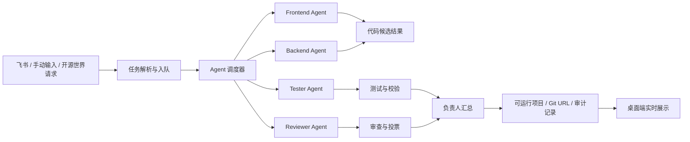

# QuantumFlow 多智能体协作开发系统

> 一个把任务调度、Agent 自动编码、代码治理、公开协作、飞书 Bot 和桌面工作台揉在一起的多智能体开发系统。


QuantumFlow 的目标不是再做一个普通聊天框，而是做一个“会组织开发过程”的桌面系统：用户把需求交给系统，Agent 团队拆分任务、编写代码、互相审查、采纳建议，并把过程以可视化方式实时呈现出来。

当前版本已经跑通 MVP：桌面端、战情工作台、源文明/开源世界、Agent 审计、飞书 Bot 基础收发、项目房间、登录注册原型、任务队列、代码编辑区和 WebSocket 实时事件。

## 核心亮点

- **多 Agent 自动编码**：Frontend、Backend、Tester、Reviewer 等角色可按任务分工执行。
- **实时战情工作台**：任务队列、事件流、Agent 状态、业务流和执行结果同步展示。
- **源文明 + 开源世界**：融合 GitHub 风格仓库管理、议题、请求、审计、公开聊天与 Agent 协作。
- **手动 / 自动编码切换**：可以从自动编码结果继续手动修改，也可以把请求交给 Agent 完成。
- **飞书 Bot 接入**：支持手动发送飞书、接收飞书任务，并规划任务双向同步闭环。
- **项目房间与邀请码**：为后续多人联机开发预留房间、成员、文件、代码和讨论空间。
- **桌面端优先**：Electron 直接打开工作台，不依赖用户手动敲命令启动页面。
- **本地优先，谨慎开源**：数据库、Webhook、Token、运行时产物默认不进入仓库。

## 系统工作流



## 项目结构

```text
D:\agent
├─ Agent.py                         # 多智能体状态机与任务调度
├─ Model.py                         # Agent 模型配置
├─ LLM.py                           # Codex/OpenAI 兼容调用入口
├─ RAG.py                           # 本地记忆与 RAG 雏形
├─ connectors.py                    # 外部 App 消息归一化
├─ connector_sender.py              # 飞书等外部发送逻辑
├─ server.py                        # FastAPI + WebSocket 服务
├─ storage.py                       # SQLite 本地持久化
├─ patch_service.py                 # 代码补丁预览与应用安全边界
├─ quantumflow-mvp/                 # 前端桌面工作台
├─ desktop-electron/                # Electron 桌面端
├─ scripts/                         # 辅助脚本
├─ assets/                          # 图标与静态资源
├─ docs/                            # 系统设计文档
└─ requirements.txt                 # Python 依赖
```

## 快速开始

安装 Python 依赖：

```powershell
pip install -r requirements.txt
```

启动后端服务：

```powershell
.\start_server.ps1
```

浏览器访问：

```text
http://127.0.0.1:8765
```

启动桌面端：

```powershell
.\start_desktop.ps1
```

如果已经安装桌面快捷方式，也可以直接双击桌面上的 QuantumFlow 图标启动。

## Codex / OpenAI 配置

所有 Agent 默认可以共用一套 Codex/OpenAI 配置：

```powershell
$env:CODEX_API_KEY="你的 key"
$env:CODEX_BASE_URL="https://api.openai.com/v1"
$env:CODEX_MODEL="gpt-5.1-codex-mini"
```

也可以按 Agent 单独覆盖：

```powershell
$env:QUANTUMFLOW_FRONTEND_API_KEY="..."
$env:QUANTUMFLOW_BACKEND_API_KEY="..."
$env:QUANTUMFLOW_TESTER_API_KEY="..."
$env:QUANTUMFLOW_REVIEWER_API_KEY="..."
```

优先级：

```text
单个 Agent 环境变量 > CODEX_* 共享变量 > OPENAI_* 兼容变量
```

## 飞书 Bot 配置

复制示例配置：

```powershell
copy connector.config.example.json connector.config.json
```

然后把 `connector.config.json` 里的 webhook 替换为自己的飞书机器人地址。

注意：`connector.config.json` 已被 `.gitignore` 忽略，不会提交到 GitHub。

## API 摘要

```text
GET  /api/snapshot                 当前 Agent / Task / Event 快照
GET  /api/history                  最近运行快照
POST /api/tasks                    创建任务
POST /api/integrations/inbound     通用外部消息入口
POST /api/integrations/feishu/callback
                                   飞书消息事件回调
POST /api/dispatch-next            分发下一步任务
POST /api/reset                    重置运行时
POST /api/patch/preview            生成候选补丁并校验
POST /api/patch/apply              应用安全补丁
WS   /ws                           推送实时状态
```

## 设计文档

系统设计文档位于：

```text
docs/QuantumFlow_System_Design_Document.docx
```

这份文档用于沉淀 QuantumFlow 的初始架构、模块边界、Connector 规划、多 Agent 调度设想和后续产品路线。

## 开发路线图

### P0：闭环验证

- Review 采纳记录落盘
- 飞书消息与任务双向同步
- 任务执行日志持久化
- Agent 写出的代码可运行、可审查、可回滚

### P1：协作能力

- 项目房间、邀请码、开发者加入项目
- 实时在线状态与成员权限
- 开源世界公开聊天
- 手动编码补全与 Agent 辅助修改

### P2：Connector 扩展

- 企业微信 / 微信客服
- 抖音客服消息
- 统一 Connector 接口：`receive_message`、`send_message`、`parse_command`

### P3：规模化与上线前验证

- 多团队 / 多项目隔离
- Prometheus + Grafana 可观测性
- k6 压测
- GitHub Actions 自动验证

## 当前状态

QuantumFlow 目前是 **Beta / 本地协作开发版**，适合继续开发、演示和小范围联机测试。

还不建议直接作为生产系统上线，因为以下能力仍在完善：

- 真实多用户权限隔离
- 生产级 Connector 验签与加密
- Agent 生成代码的沙箱执行与质量门禁
- 公网联机安全策略
- 完整审计、回滚与压测链路

## 安全说明

以下内容不会提交到仓库：

- `connector.config.json`
- `.env` / `.env.*`
- `quantumflow.db`
- `desktop-electron/node_modules/`
- `generated_repos/`
- `patches/`
- ZeroTier / 防火墙 / 隧道运行结果文件

如果你要二次开发，请优先使用环境变量和示例配置文件，不要把 webhook、token、数据库和本地缓存直接提交到公开仓库。

## 一句话

QuantumFlow 想做的是一个能看见、能协作、能自动写代码、也能被人类接管的多智能体开发世界。

## 命令行启动

QuantumFlow 支持像 OpenClaw 一样从 CMD 或 PowerShell 启动。

CMD：

```cmd
qflow desktop
qflow server
qflow platform
qflow admin
qflow status
qflow stop
```

PowerShell：

```powershell
.\qflow.ps1 desktop
.\qflow.ps1 server
.\qflow.ps1 platform
.\qflow.ps1 admin
.\qflow.ps1 status
.\qflow.ps1 stop
```

默认推荐：

```cmd
qflow desktop
```

这个命令会自动准备 Python 虚拟环境、启动 FastAPI 服务，并打开桌面/浏览器工作台。

更多适用场景见：

```text
docs/project-scenarios.md
```
